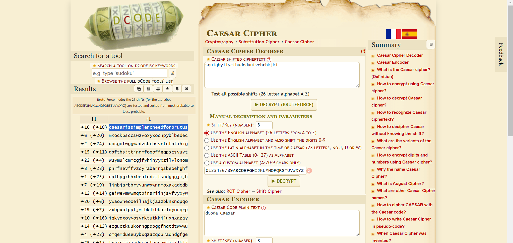
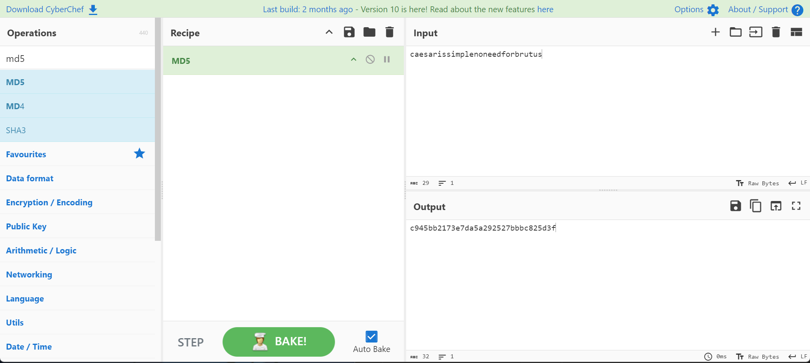

##### <- [Back to Huntress CTF 2024](../README.md)

---

# No need for Brutus (Cryptography)
Part of the Huntress CTF 2024

#### Description
`A simple message for you to decipher:`

`squiqhyiiycfbudeduutvehrhkjki`

`Submit the original plaintext hashed with MD5, wrapped between the usual flag format: flag{}`

### Solution
Looking at this problem it looks like there are going to be two parts: solve the cipher and then MD5 hash the result (and wrap the flag format around it.)

Let's start by analyising the cipher. During CTFs, titles can give you a small or big hint about what to do next. With the title of 'No need for Brutus' it makes me think of the Caeser Cipher (et tu brute).

When it comes to attempting to bruteforce a cipher, when applicable, I prefer a site called [Dcode](https://www.dcode.fr/en). It has a cipher identifier I use a lot, etc. In this case, we are going to skip that and go right to the Caeser Cipher decoder found at [https://www.dcode.fr/caesar-cipher](https://www.dcode.fr/caesar-cipher).



We take the encoded string in the decription `squiqhyiiycfbudeduutvehrhkjki` and place it in the text box under 'Ceaser Cipher Decoder' and we hit the button `DECRYPT (BRUTEFORCE)`. 

It works it's magic and it puts the most likely candidate at top of the list under `Results`, on the left. In this case, it's best guess is `caesarissimplenoneedforbrutus` and after a quick analysis, it looks to be correct.

Now that we have the decoded data, we have another step, in which must MD5 hash that data and wrap it in the flag format before we can submit it.

There are a multitude of MD5 Hash Generators on the web, and you can search Google and choice almost any one of them. However, I prefer to use [CyberChef](https://gchq.github.io/CyberChef/) when I can, as it's an amazing swiss army knife of CTFs. 

I put the deciphered data from step one into the `input` box, drag `MD5` over to the Recipe column and voila we have our answer.

***One important note, MD5 is extremely sensitive, so make sure you copy the data from step one exactly as it's provided. Extra spaces, added or changed characters, weird symbols, etc. will completly alter the resulting MD5. It's usually always best to copy and paste the data so it stays intact.***



We now take that resulting MD5 hash `c945bb2173e7da5a292527bbbc825d3f` and wrap it in the flag format for this CTF, to get the flag.


#### FLAG
```
flag{c945bb2173e7da5a292527bbbc825d3f}
```
---

##### <- [Back to Huntress CTF 2024](../README.md)