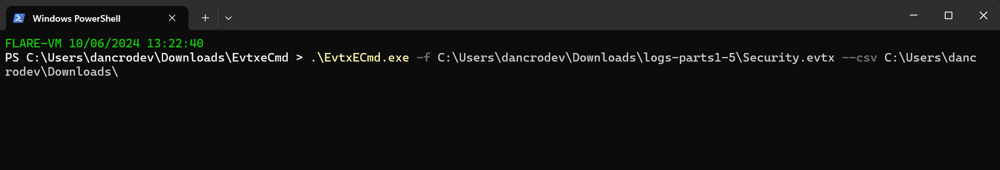

##### <- [Back to Huntress CTF 2024](../README.md)

---

# Nightmare on Hunt Street - Part 1 (Forensics) 
Part of the Huntress CTF 2024

```
Important:
This is a multi-part challenge, made up of five (5) differnt parts that make up the challenge group. Each challenge results in a unique flag, based on a shared data set. It makes sense if you read them in order Part 1-5, to get a full grasp of the setup and investigation.

Also Important:
NOTE: Flags for Part #1 to Part #5 will all be human-readable answers and in a non-standard flag format. You will use the same downloadable attachment and log files to answer all the questions.
```

#### Description
`DeeDee hears the screams, In the logs, a chilling trace— Freddy's waiting near.`

`Are you able to unravel the attack chain? The first question is:`

`What is the IP address of the host that the attacker used?`

### Attachments
`logs-parts1-5.zip`

### Solution
Alright, judging by the description and attachment, we are doing some investigative work in some logs. Let's download the .zip and see what it contains:


Looks like Windows Event Logs. Let's load up `Security.evtx` as it seems to have much more data.


```text
Note:
At this point, only one of the three will load (only System will load for me). My teammates, had varying levels of success over these three .evtx files, some would load locally but wouldn't load on VM and vise versa. 
```

A teammate brought up a collection of tools called [Eric Zimmerman's tools](https://ericzimmerman.github.io/#!index.md) which included a few tools that may help, most specificially `EvtxECmd` ("Event log (evtx) parser with standardized CSV, XML, and json output! Custom maps, locked file support, and more!") and `Timeline Explorer` ("View CSV and Excel files, filter, group, sort, etc. with ease"). The site has a nice Powershell script that will pull the tools down for you.


Big collection of some really good tools.

Before we can use `Timeline Explorer` we need to extract the data out of the `.evtx` file(s) and convert to CSV. This is where `EvtxECmd` will coming into play:



Upon running we get a bunch of information, the important part being the created csv file name and where it shows it successful exported.


```text
My output .csv is 20241006202306_EvtxECmd_Output.csv, yours will be different.
```

Now that we've accomplished that, let's open up `Timeline Explorer`. It loads up pretty blank, so go to `File > Open` and select the .csv file output from the above command.


Now we are getting somewhere. Look at all that Loggy goodness.

It's my assumption that this system was accessed remotely, typically. This allows me to have a start point when I'm looking for some sort of IP address. In this case, I want to look at logon attempts/successes, so I'm going to go up to the `Enter text to search...` box and put in `4624` and click find. This event ID is the one used for successful logons. It's a good start point. (it's beside the red line I drew)


Once we hit `Find` we get the following results


If we scroll over on the data set and look at the Remote Hosts, you notice something quite telling, our friend `Kali Linux` makes an apperance. Next to these entries is also an IP address. The one we are after.


For this flag, they only want the IP address, don't wrap it in the flag{}


#### FLAG
```
10.1.1.42
```
---

##### <- [Back to Huntress CTF 2024](../README.md)