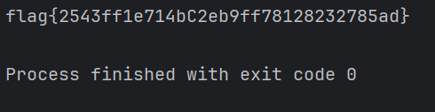

##### <- [Back to Huntress CTF 2024](../README.md)

---

# Discount Programming Devices (Malware)
Part of the Huntress CTF 2024

#### Description
`I used a tool on the internet to obfuscate my script!`
`But I lost it, and I don't know how to get it back.`
`Maybe you can help?`

### Attachments
`oops.py`

### Solution
Let's download that python script and see what we have to work with. 


Looks like there is sourcecode encoded with base64. I'm curious if anything happens if we run the script, so I'm going to start there.



Um...

I'm not sure if that's supposed to happen or not...

But we got the flag (and it's the correct one). Neat.

#### FLAG
```
flag{2543ff1e714bC2eb9ff78128232785ad}
```
---

##### <- [Back to Huntress CTF 2024](../README.md)