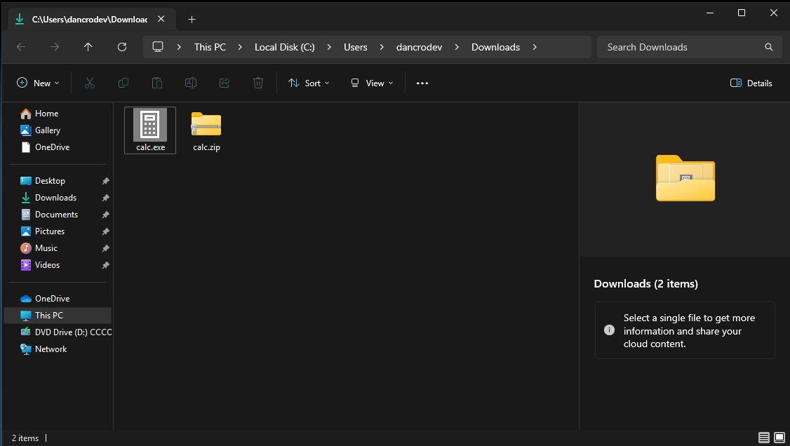
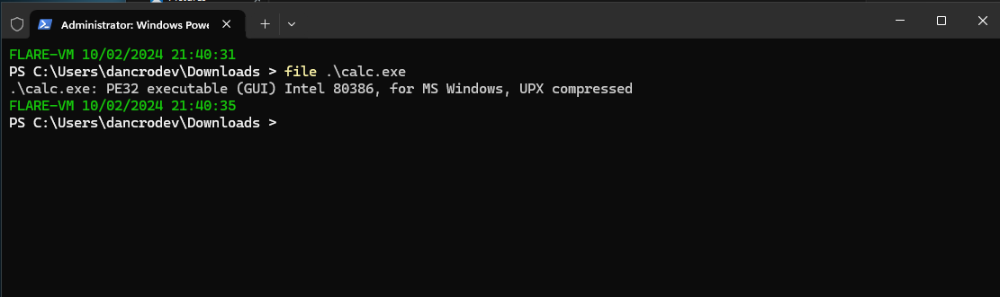
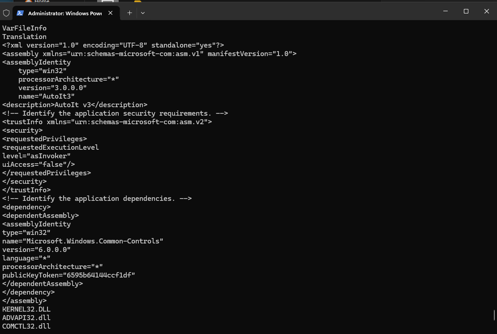
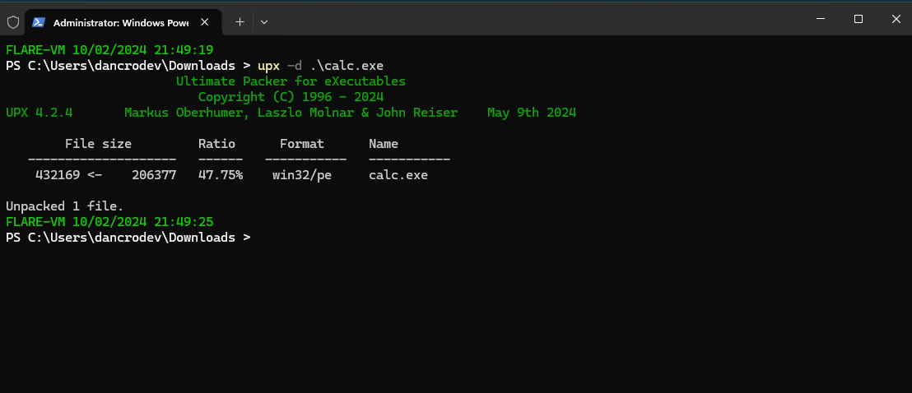
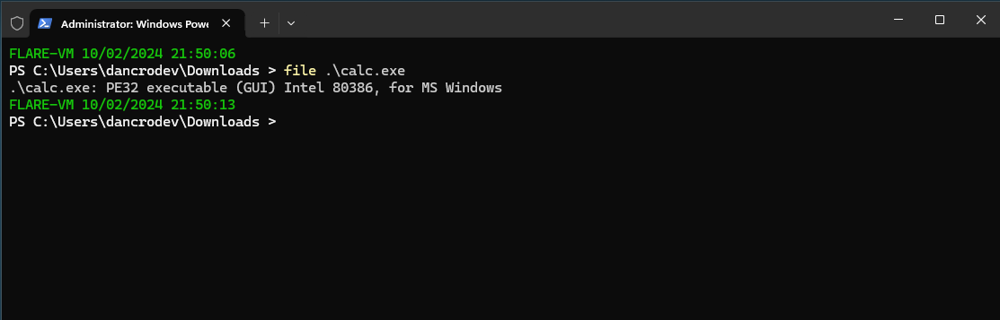
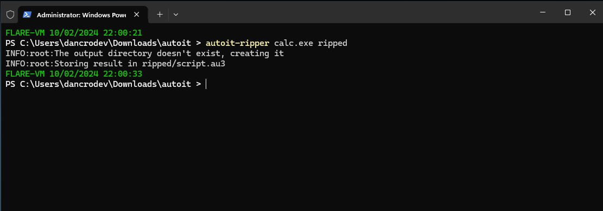

##### <- [Back to Huntress CTF 2024](../README.md)

---

# Strange Calc (Malware)
Part of the Huntress CTF 2024

#### Description
`I got this new calculator app from my friend! But it's really weird, for some reason it needs admin permissions to run??`

`NOTE: Archive password is strange_calc`

### Attachments
`calc.zip`

### Solution
Originally the attachment was `calc.exe` and shortly after starting the CTF they changed it to `calc.zip` which, of course, housed the `calc.exe`. 



As I typically do, I ran `file` and `strings` against the .exe file, and got the following important bits:



First piece of valuable information using `file`, as it let's us know that the binary `calc.exe` is actually compressed using UPX.

Now we run `strings`. It provides the normal barrage of random texts and characters. Having searched the entire result, I see no flags, so no easy win here. I did notice something interesting somewhere in the middle however. 



It references `AutoIt3`, which is uknown to me but turns out to be a "BASIC-like scripting language designed for automating the Windows GUI and general scripting". Interesting. 

At this point we know it's UPX Packed and at least something within the binary references AutoIt 3 a Windows scripting language.

After some research a teammate found `AutoIt-Ripper` which can be downloaded [here](https://github.com/nazywam/AutoIt-Ripper). The next steps were to remove the UPX compression and use the AutoIt-Ripper on the result to see what we end up with.

The `upx` package is used to compress binaries, but it also has a flag `-d` to decompress packages compressed by the package as well. Let's start there. 



`Unpacked 1 file` tells me that it was successful. Running `file` against `calc.exe` again, shows that the UPX compression bit is now gone. Success!



Now that we are left with the uncompressed binary, let's look deeper into the `AutoIt-Ripper` package and see if it will work any magic.

Following the `AutoIt-Ripper` instructions, we need to install the package via `pip`. On my FlareVM instance, this was the command I used, it may differ slightly.

`py -m pip install autoit-ripper`

Turns out my version of FlareVM already has autoit-ripper installed, but you may need to run the above command.

I run the command, providing the name of the binary `calc.exe` as well as where I want the rip output to be put, in this case a folder called `ripped`

`autoit-ripper calc.exe ripped`



That looks to be successful. Looking in the `ripped` subfolder I find a single file: `script.au3`


#### FLAG
```
flag{}
```
---

##### <- [Back to Huntress CTF 2024](../README.md)