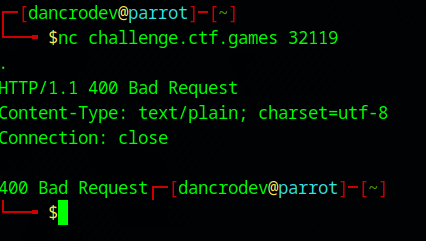
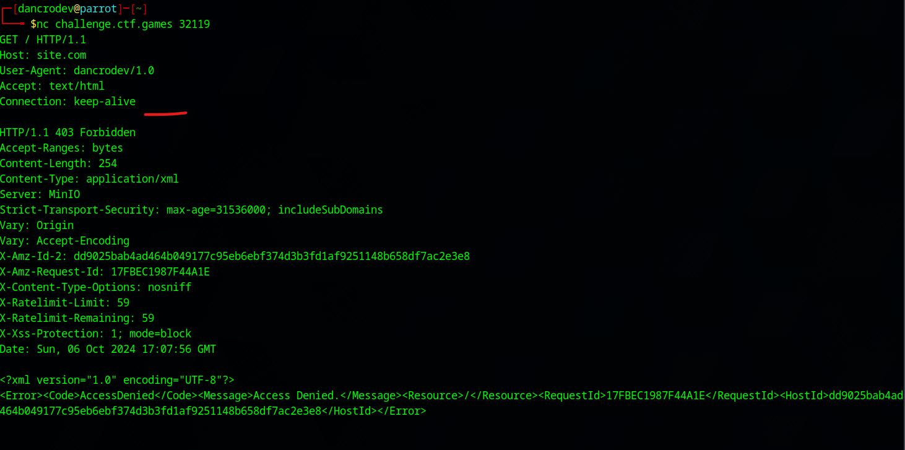
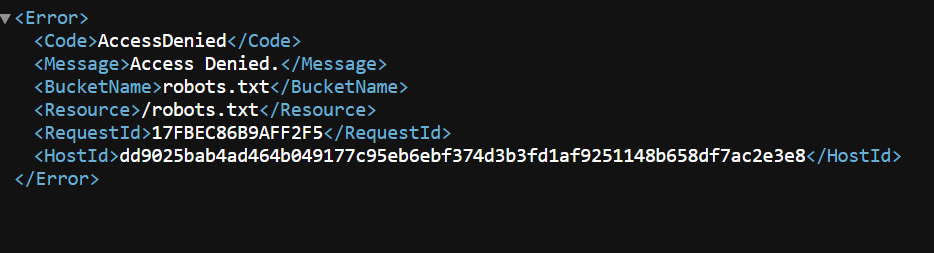
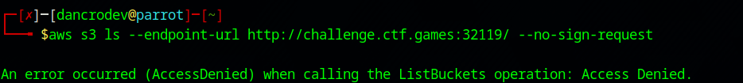
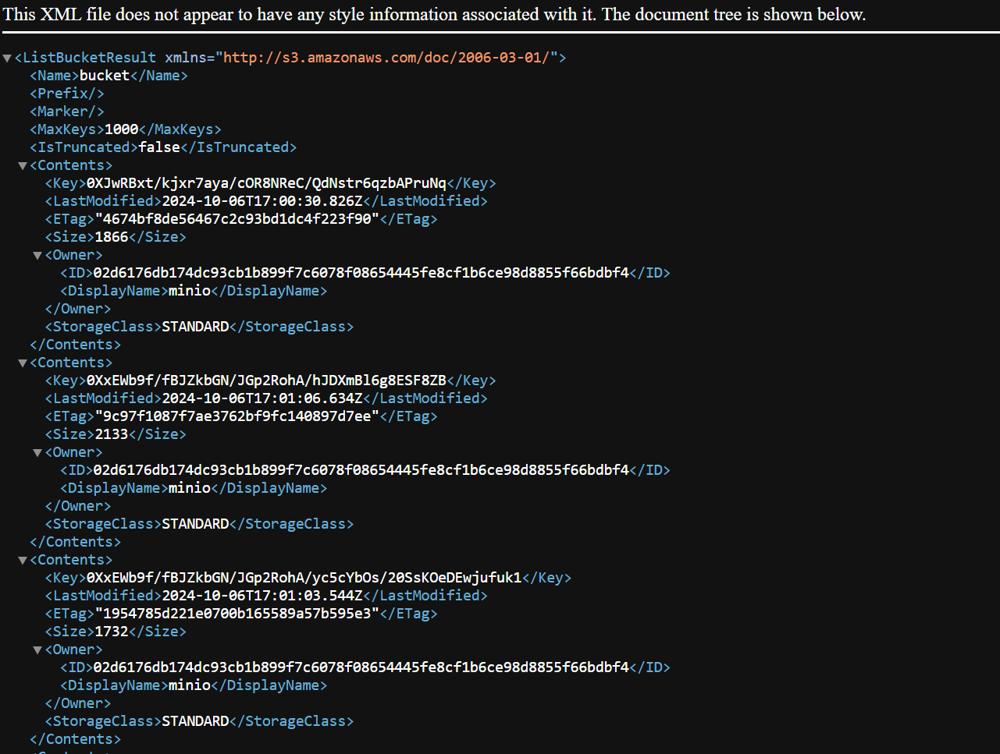
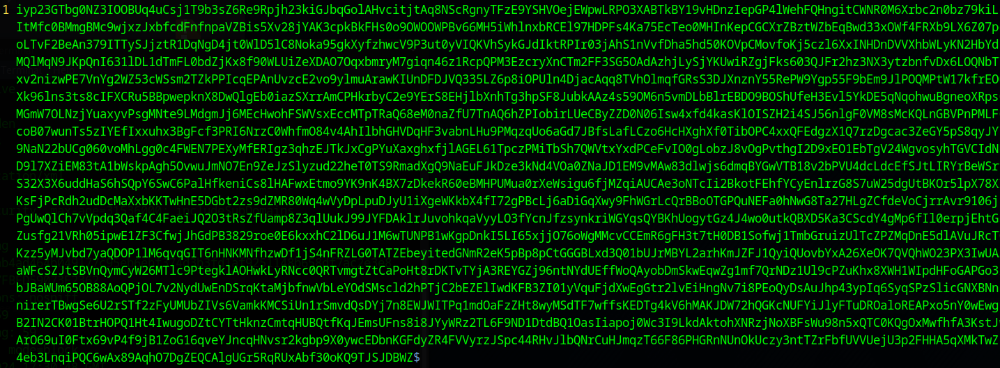
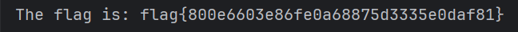

##### <- [Back to Huntress CTF 2024](../README.md)

---

# Malibu (Misc) 
Part of the Huntress CTF 2024

#### Description
`What do you bring to the beach?`

### Solution

With a very short description and no attachments, it's time to click the `Start` button, spin up an instance and check out what we have access to.

```
They mentioned it taking a little longer, and it does. It took me up to 30 seconds to see the site. 
```


The connection it provided me was: `nc challenge.ctf.games 32119`. Let's connect to it in the terminal. 



After a good amount of waiting we are able to access. On initial access, it doens't give you any prompt or instructions, it's waiting for you to something. Just to test it, I typed in a period and hit enter to see what it would do. It gave me back a HTTP/1.1 400 error of `Bad Request`. This is a HTTP server. 

Let's reconnect and try to give it a more fully formed HTTP request:

```http
GET / HTTP/1.1
Host: site.com
User-Agent: dancrodev/1.0
Accept: text/html
Connection: keep-alive
```


Since this is a HTTP server, let's take this to the browser and see if we can find anything.


Accessing the URL in the browser.. redirects me to a different port.


Strange. I tried navigating to any page on the new port as well as tried to connect it via `nc` and it's giving me nothing. Let's focus on the original port for now. 

I tried to access the `challenge.ctf.games:32119/robots.txt` to see if it would provide anything. (I tried sitemap.xml as well, got similar result)



As a Solutions Architect and "cloud guy", this looks very familiar, we are using `AWS S3`. Let me use `AWS CLI` in the terminal to see if we can fetch a list of buckets. 



Hmm, doesn't help. So loading the root page redirects us to another port and accessing any other path, we get an error like the `robots.txt` one above. After reviewing the description of "What do you bring to the beach?" in conection with `S3` a teammate figured out the correct answer was `bucket`. Makes sense.

We tried accessing the `/bucket` route and got something new.



Looking at the `<DisplayName></DisplayName>` fields, this actually gives us another bit of information. This server isn't `AWS S3` but a compatible storage server called `MinIO`. 

Let's copy one of the `<Key></Key>` strings and use it as a path after our url:


It immediately downloads a file, let's check it out.



Upon downloading another example, it's very similar, but different text. Looking at the XML file in the `/bucket` path, there is a chance that somewhere in all of these files, in all of these text files there is a plaintext flag. Our guess was that or this all needs to be combined someway into some sort of encryption. Let's try the low hanging fruit first and create a python script to do the following:

- Retrieve XML from the `/bucket` path
- Parse the results
- Download all of the files on the list
- Read them into Python and see if any of them match a `flag{` string
- Output the result

***Let's build it.***

```python
import requests
import xml.etree.ElementTree as ET
import re

# URL of the XML file
url = "http://challenge.ctf.games:32119/bucket/"
regex = "flag{[A-Za-z0-9]+}"

# Fetch the XML data
response = requests.get(url)

# Parse the XML data
tree = ET.ElementTree(ET.fromstring(response.content))
root = tree.getroot()

# Remove namespace prefixes for easier access
for elem in root.iter():
    
    # This removes the namespace prefix if it exists
    elem.tag = elem.tag.split('}')[-1]

# Iterate through all the <Key> items (the file paths)
for key in root.findall('.//Key'):
    
    # Use the key path, append to the url, and pull the contents
    file = requests.get(url + key.text).content
    
    # If the string "flag{" is found in the contents
    if "flag{" in file.decode("utf-8"):
        
        # Search the text for the full flag (using the above regex)
        flag = re.search(regex, file.decode("utf-8"))
        
        # Flag is found, print it out
        print(f"The flag is: {flag.group()}")

```

Our script works. The result (and success):




#### FLAG
```
flag{800e6603e86fe0a68875d3335e0daf81}
```
---

##### <- [Back to Huntress CTF 2024](../README.md)