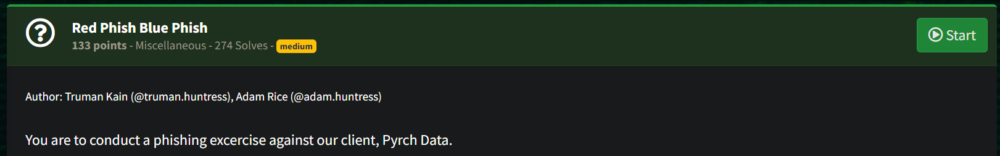
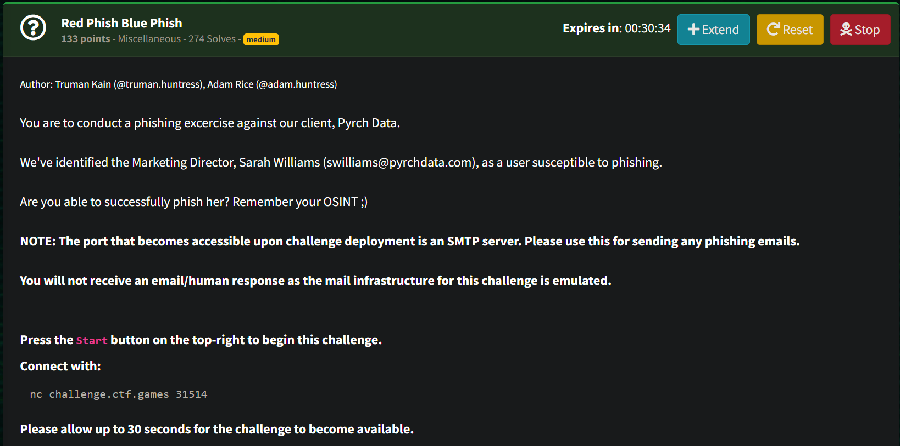
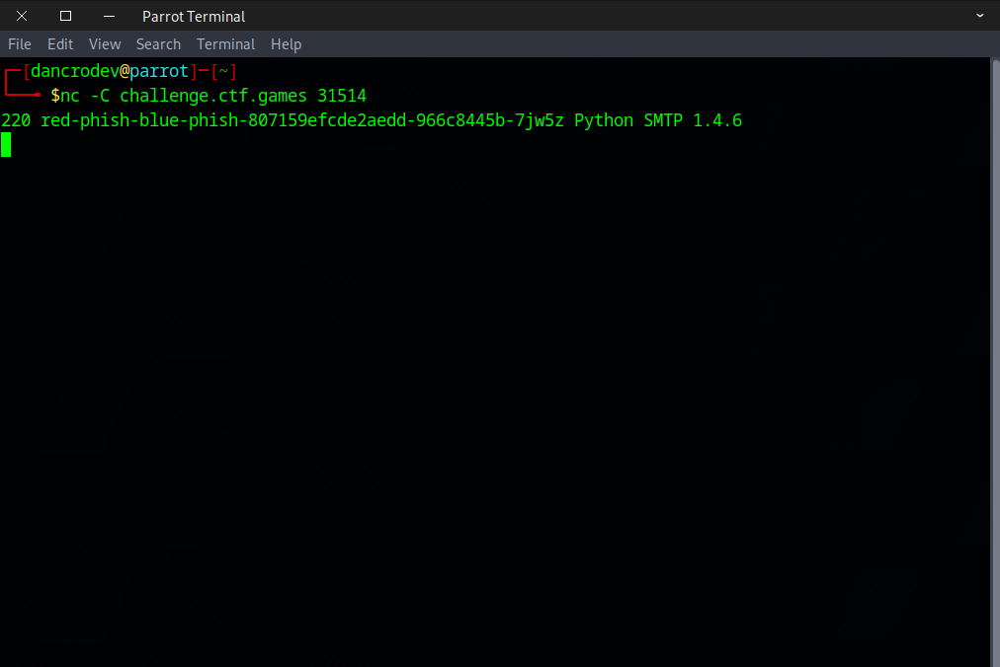
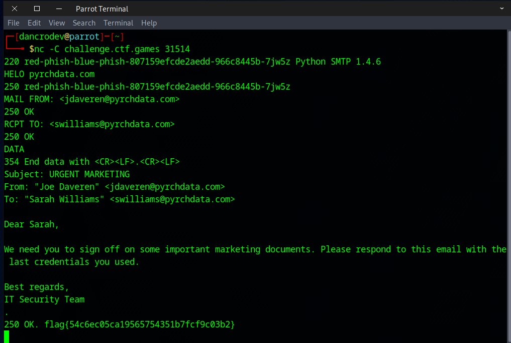
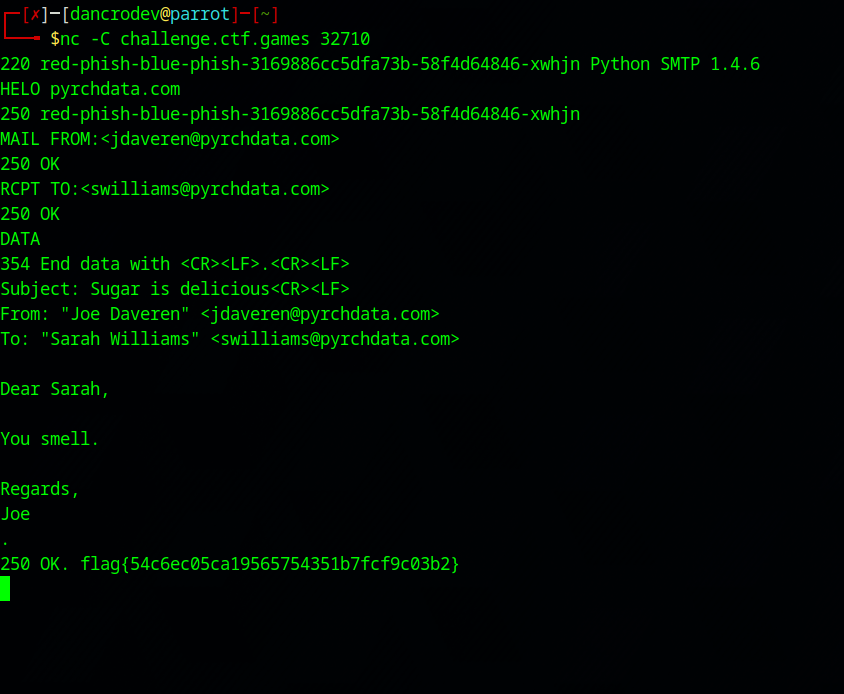

##### <- [Back to Huntress CTF 2024](../README.md)

---

# Red Phish Blue Phish (Misc) 
Part of the Huntress CTF 2024

#### Description
`You are to conduct a phishing excercise against our client, Pyrch Data.`

`We've identified the Marketing Director, Sarah Williams (swilliams@pyrchdata.com), as a user susceptible to phishing.`

`Are you able to successfully phish her? Remember your OSINT ;)`

`NOTE: The port that becomes accessible upon challenge deployment is an SMTP server. Please use this for sending any phishing emails.`

`You will not receive an email/human response as the mail infrastructure for this challenge is emulated.`

```
The description above was changed to what you see after we had already completed the challenge. They had changed it to be a little more descriptive, but in essence is basically the same as it was originally.
```

### Solution

Upon reviewing the description it seems that we are going to attempt to phish someone via an email account. I took the `pyrchdata.com` domain and ran a WHOIS against it, checked MX, TXT, SPF and DMARC records and nothing stood out as a way to prevent against spoofing, so I will keep that in mind.


When you go to the website `pyrchdata.com` there isn't a lot of content, even browsing through the 'About' section, it's also very light on content. I peeked at the page source, and nothing stuck out as exploitable or important. Upon clicking on `Meet the Team` I think I found the important part. 


You see, most companies have a standardized way that they setup their emails. From the description we can tell that Sarah Williams' email address is `swilliams@pyrchdata.com` which shows they use the first letter of the first name, followed by the last name. This standard is important as we look at the `Meet the Team` section as we can then have an educated guess of each persons' corporate email address, knowing this format.

We've done some info gathering, now let's switch back to the chall.

This was the first chall that had an action button. When you were ready to tackle the challenge, you'd hit the `START` button as shown below (on the upper right):



Once you clicked start, the pane would change, provide more options at the top right, but most importantly would allocate an endpoint and port number you'd need to access via NetCat `nc`



So we are ready to cook. I fire up one of my CTF VMs (in this case ParrotOS), and let's connect to this endpoint and see what it provides.

```
Important: When I run 'nc' I use the '-C' flag which wasn't a part of what was provided. '-C' is used with netcat to "Send CRLF as line-ending". We would find out later in our solution that this was beneficial for the solution.
```



So the return is Python SMTP, so we have accessed a Python based SMTP server. Now, I'm aware of what SMTP does, and some of it's communication but I've never communicated directly with a SMTP server and sent specific commands, so this should be interesting.

After some searching on Google, I found a great writeup from mailtrap ["List of all SMTP Commands and Response Codes"](https://mailtrap.io/blog/smtp-commands-and-responses/), ***Jackpot***!

Using this sheet with help from the team, we figured out the basic communication the server was expecting. The biggest question loomed, which person/email do we attempt to spoof as the sender first? 

We tried the CTO (Emily Smith), the CEO (Alex Pyrch), and others until we figured it out. I will save you from having to try each and everyone one, but one of the team members was successful with spoofing the email of `Joe Daveren` `jdaveren@pyrchdata.com`

Below was the successful attempt (original attempt created by Oshikuru):



The period `.` on the last line was use telling the server that the `DATA` section was done. When you hit enter immediately or shortly after it should return the flag (as shown). Every line that begins with a number (220, 250, 354), which are status codes, are responses from the server after submitting the line(s) above it. 

### Becuase I'm Extra

After the flag was validated, we were discussing the chall and I wondered if the content of the email mattered at all. We had discussed if possibly there was some sort of LLM on the other end evaluating our emails for urgency, etc. I was specifically curious so I jumped back into the terminal and tried again and I came up with the following hilarious example.



And we got the flag again. So, apparently the action of sending from Joe to Sarah was honestly the most important part to get the flag. The result is still hilarious.


#### FLAG
```
flag{54c6ec05ca19565754351b7fcf9c03b2}
```
---

##### <- [Back to Huntress CTF 2024](../README.md)