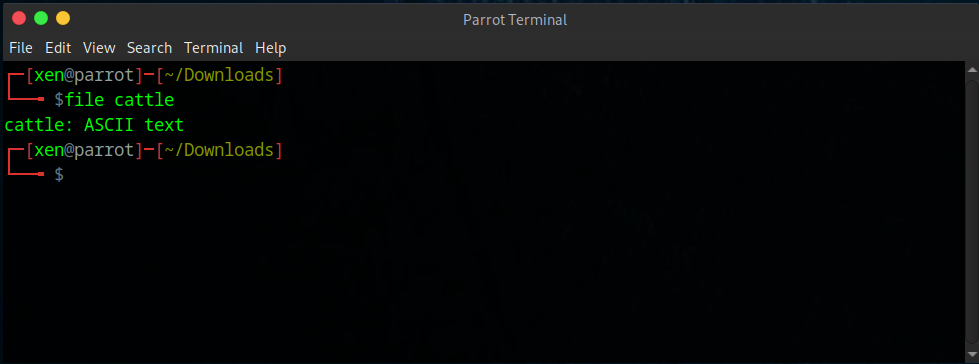
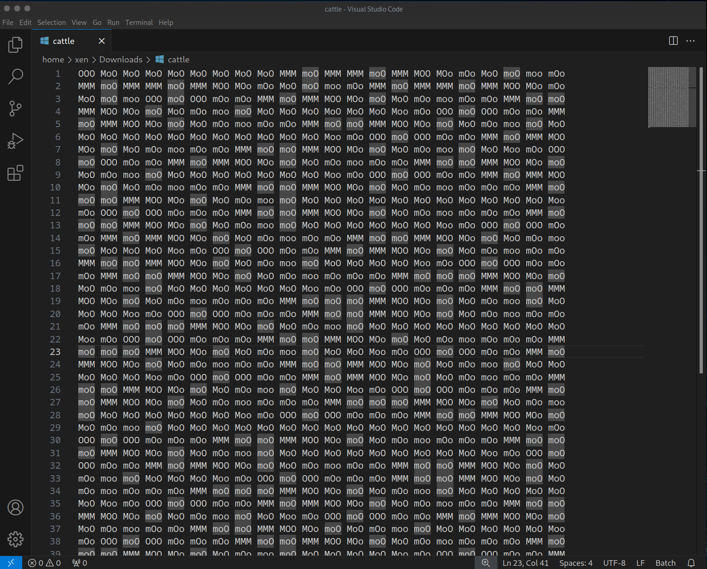
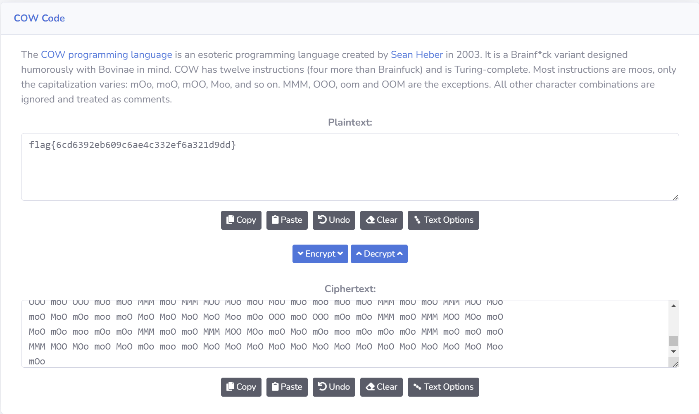

##### <- [Back to Huntress CTF 2024](../README.md)

---

# Cattle (Warmups)
Part of the Huntress CTF 2024

#### Description
`I know it's an esoteric challenge for a Capture the Flag, but could you herd these cows for me?`

### Attachements
`cattle`

### Solution
After downloading the file and running `file` - it turns out to be a simple text file.



Let's open it up and see what's inside.



😂 It's `COW`!! I've dealt with this in the past, due to other CTFs. [`COW`]() is a programming language, and a variant of the [`Brainfuck`](https://en.wikipedia.org/wiki/Brainfuck) language. These are both popular in CTFs. I've linked the wiki page for both above, so you can get more information if you are curious.

Since we have actual `COW` code, let's load up a web-based COW code intepreter and see what the output is. I'll be using [CacheSleuth's Cow Code Interpreter](https://www.cachesleuth.com/cow.html).



Load the COW Code into the `Ciphertext` box and hit Decrypt. It gives us the flag we are looking for.

🐄 Moo, ya'll. 🐄

#### ***Just For Fun: Convert this message I made for you.*** 
```
OOO MoO MoO MoO MoO MoO MoO MoO MoO MMM moO MMM MMM moO MMM MOO MOo mOo MoO moO moo mOo MMM moO MMM MMM moO MMM MOO MOo mOo MoO moO moo mOo MMM moO MMM MMM moO MMM MOO MOo mOo MoO moO moo OOO moO OOO mOo mOo MMM moO MMM MOO MOo moO MoO mOo moo mOo mOo mOo MMM moO moO moO MMM MOO MOo moO MoO mOo moo moO MoO MoO MoO MoO MoO MoO MoO MoO MoO Moo mOo OOO moO OOO mOo mOo MMM moO MMM MOO MOo moO MoO mOo moo mOo mOo MMM moO moO MMM MOO MOo moO MoO mOo moo moO MoO MoO MoO MoO MoO MoO MoO MoO MoO MoO MoO MoO MoO MoO MoO Moo mOo OOO moO OOO mOo mOo MMM moO MMM MOO MOo moO MoO mOo moo mOo mOo MMM moO moO MMM MOO MOo moO MoO mOo moo mOo mOo mOo MMM moO moO moO MMM MOO MOo moO MoO mOo moo moO MoO MoO MoO MoO MoO Moo mOo OOO moO OOO mOo mOo mOo mOo MMM moO moO moO MMM MOO MOo moO MoO mOo moo moO MoO MoO MoO MoO MoO MoO MoO MoO MoO MoO MoO MoO MoO MoO MoO MoO Moo mOo OOO moO OOO mOo mOo MMM moO MMM MOO MOo moO MoO mOo moo mOo mOo MMM moO moO MMM MOO MOo moO MoO mOo moo moO MoO MoO MoO MoO Moo mOo OOO moO OOO mOo mOo MMM moO MMM MOO MOo moO MoO mOo moo mOo mOo MMM moO moO MMM MOO MOo moO MoO mOo moo moO MoO MoO MoO MoO MoO MoO MoO MoO MoO Moo mOo OOO moO OOO mOo mOo MMM moO MMM MOO MOo moO MoO mOo moo mOo mOo MMM moO moO MMM MOO MOo moO MoO mOo moo moO MoO MoO MoO MoO Moo mOo OOO moO OOO mOo mOo mOo mOo MMM moO moO moO MMM MOO MOo moO MoO mOo moo moO MoO MoO MoO MoO MoO MoO MoO MoO MoO MoO MoO MoO MoO MoO MoO MoO Moo mOo OOO moO OOO mOo mOo MMM moO MMM MOO MOo moO MoO mOo moo mOo mOo MMM moO moO MMM MOO MOo moO MoO mOo moo moO MoO Moo mOo OOO moO OOO mOo mOo mOo mOo MMM moO moO moO MMM MOO MOo moO MoO mOo moo moO MoO MoO MoO MoO MoO MoO MoO MoO MoO MoO MoO MoO MoO MoO MoO MoO Moo mOo OOO moO OOO mOo mOo MMM moO MMM MOO MOo moO MoO mOo moo moO MoO MoO MoO MoO MoO MoO MoO MoO MoO MoO MoO MoO MoO Moo mOo OOO moO OOO mOo mOo MMM moO MMM MOO MOo moO MoO mOo moo mOo mOo MMM moO moO MMM MOO MOo moO MoO mOo moo moO MoO MoO MoO MoO MoO MoO MoO MoO MoO MoO MoO MoO MoO MoO MoO Moo mOo OOO moO OOO mOo mOo MMM moO MMM MOO MOo moO MoO mOo moo mOo mOo MMM moO moO MMM MOO MOo moO MoO mOo moo moO MoO MoO MoO MoO MoO MoO MoO MoO MoO MoO MoO MoO MoO MoO MoO Moo mOo OOO moO OOO mOo mOo mOo MMM moO moO MMM MOO MOo moO MoO mOo moo moO MoO MoO MoO MoO MoO MoO MoO MoO MoO MoO MoO MoO MoO Moo mOo OOO moO OOO mOo mOo MMM moO MMM MOO MOo moO MoO mOo moo mOo mOo MMM moO moO MMM MOO MOo moO MoO mOo moo mOo mOo mOo MMM moO moO moO MMM MOO MOo moO MoO mOo moo moO MoO MoO MoO MoO MoO MoO Moo mOo OOO moO OOO mOo mOo MMM moO MMM MOO MOo moO MoO mOo moo mOo mOo MMM moO moO MMM MOO MOo moO MoO mOo moo moO MoO MoO MoO MoO MoO Moo mOo OOO moO OOO mOo mOo MMM moO MMM MOO MOo moO MoO mOo moo mOo mOo MMM moO moO MMM MOO MOo moO MoO mOo moo moO MoO MoO MoO MoO MoO MoO MoO MoO MoO MoO MoO MoO Moo mOo OOO moO OOO mOo mOo MMM moO MMM MOO MOo moO MoO mOo moo mOo mOo MMM moO moO MMM MOO MOo moO MoO mOo moo moO MoO MoO MoO MoO MoO MoO MoO MoO MoO MoO MoO MoO MoO MoO MoO Moo mOo OOO moO OOO mOo mOo MMM moO MMM MOO MOo moO MoO mOo moo mOo mOo MMM moO moO MMM MOO MOo moO MoO mOo moo mOo mOo mOo MMM moO moO moO MMM MOO MOo moO MoO mOo moo moO MoO MoO MoO MoO MoO Moo mOo OOO moO OOO mOo mOo MMM moO MMM MOO MOo moO MoO mOo moo mOo mOo MMM moO moO MMM MOO MOo moO MoO mOo moo mOo mOo mOo MMM moO moO moO MMM MOO MOo moO MoO mOo moo moO MoO MoO MoO Moo mOo OOO moO OOO mOo mOo mOo mOo MMM moO moO moO MMM MOO MOo moO MoO mOo moo moO MoO MoO MoO MoO MoO MoO MoO MoO MoO MoO MoO MoO MoO MoO MoO MoO Moo mOo OOO moO OOO mOo mOo MMM moO MMM MOO MOo moO MoO mOo moo mOo mOo MMM moO moO MMM MOO MOo moO MoO mOo moo moO MoO MoO MoO MoO MoO MoO MoO MoO MoO MoO Moo mOo OOO moO OOO mOo mOo MMM moO MMM MOO MOo moO MoO mOo moo mOo mOo MMM moO moO MMM MOO MOo moO MoO mOo moo moO MoO MoO MoO MoO MoO MoO MoO MoO MoO MoO MoO MoO MoO MoO MoO Moo mOo OOO moO OOO mOo mOo MMM moO MMM MOO MOo moO MoO mOo moo mOo mOo MMM moO moO MMM MOO MOo moO MoO mOo moo moO MoO MoO Moo mOo OOO moO OOO mOo mOo mOo mOo MMM moO moO moO MMM MOO MOo moO MoO mOo moo moO MoO MoO MoO MoO MoO MoO MoO MoO MoO MoO MoO MoO MoO MoO MoO MoO Moo mOo OOO moO OOO mOo mOo MMM moO MMM MOO MOo moO MoO mOo moo mOo mOo MMM moO moO MMM MOO MOo moO MoO mOo moo mOo mOo mOo MMM moO moO moO MMM MOO MOo moO MoO mOo moo moO MoO MoO MoO MoO MoO MoO MoO Moo mOo OOO moO OOO mOo mOo MMM moO MMM MOO MOo moO MoO mOo moo mOo mOo MMM moO moO MMM MOO MOo moO MoO mOo moo moO MoO MoO MoO MoO MoO MoO MoO MoO MoO Moo mOo OOO moO OOO mOo mOo MMM moO MMM MOO MOo moO MoO mOo moo mOo mOo MMM moO moO MMM MOO MOo moO MoO mOo moo mOo mOo mOo MMM moO moO moO MMM MOO MOo moO MoO mOo moo moO MoO MoO MoO MoO Moo mOo OOO moO OOO mOo mOo MMM moO MMM MOO MOo moO MoO mOo moo mOo mOo MMM moO moO MMM MOO MOo moO MoO mOo moo moO MoO MoO MoO MoO MoO MoO MoO MoO Moo mOo OOO moO OOO mOo mOo mOo mOo MMM moO moO moO MMM MOO MOo moO MoO mOo moo moO MoO MoO MoO MoO MoO MoO MoO MoO MoO MoO MoO MoO MoO MoO MoO MoO Moo mOo OOO moO OOO mOo mOo MMM moO MMM MOO MOo moO MoO mOo moo mOo mOo MMM moO moO MMM MOO MOo moO MoO mOo moo mOo mOo mOo MMM moO moO moO MMM MOO MOo moO MoO mOo moo moO MoO MoO MoO MoO Moo mOo OOO moO OOO mOo mOo MMM moO MMM MOO MOo moO MoO mOo moo mOo mOo MMM moO moO MMM MOO MOo moO MoO mOo moo moO MoO MoO MoO MoO MoO MoO MoO MoO Moo mOo OOO moO OOO mOo mOo MMM moO MMM MOO MOo moO MoO mOo moo mOo mOo MMM moO moO MMM MOO MOo moO MoO mOo moo moO MoO MoO MoO MoO MoO MoO MoO MoO MoO Moo mOo OOO moO OOO mOo mOo MMM moO MMM MOO MOo moO MoO mOo moo mOo mOo MMM moO moO MMM MOO MOo moO MoO mOo moo mOo mOo mOo MMM moO moO moO MMM MOO MOo moO MoO mOo moo moO MoO MoO MoO Moo mOo OOO moO OOO mOo mOo mOo mOo MMM moO moO moO MMM MOO MOo moO MoO mOo moo moO MoO MoO MoO MoO MoO MoO MoO MoO MoO MoO MoO MoO MoO MoO MoO MoO Moo mOo OOO moO OOO mOo mOo MMM moO MMM MOO MOo moO MoO mOo moo mOo mOo MMM moO moO MMM MOO MOo moO MoO mOo moo moO MoO MoO MoO Moo mOo OOO moO OOO mOo mOo MMM moO MMM MOO MOo moO MoO mOo moo mOo mOo MMM moO moO MMM MOO MOo moO MoO mOo moo moO MoO MoO MoO MoO MoO MoO MoO MoO Moo mOo OOO moO OOO mOo mOo MMM moO MMM MOO MOo moO MoO mOo moo mOo mOo MMM moO moO MMM MOO MOo moO MoO mOo moo moO MoO Moo mOo OOO moO OOO mOo mOo MMM moO MMM MOO MOo moO MoO mOo moo mOo mOo MMM moO moO MMM MOO MOo moO MoO mOo moo moO MoO MoO MoO MoO MoO MoO MoO MoO MoO MoO MoO MoO Moo mOo OOO moO OOO mOo mOo MMM moO MMM MOO MOo moO MoO mOo moo mOo mOo MMM moO moO MMM MOO MOo moO MoO mOo moo moO MoO MoO MoO MoO MoO MoO MoO MoO MoO MoO MoO MoO Moo mOo OOO moO OOO mOo mOo MMM moO MMM MOO MOo moO MoO mOo moo mOo mOo MMM moO moO MMM MOO MOo moO MoO mOo moo moO MoO MoO MoO MoO MoO Moo mOo OOO moO OOO mOo mOo MMM moO MMM MOO MOo moO MoO mOo moo mOo mOo MMM moO moO MMM MOO MOo moO MoO mOo moo moO MoO MoO MoO MoO MoO MoO MoO MoO MoO MoO MoO MoO MoO MoO Moo mOo OOO moO OOO mOo mOo MMM moO MMM MOO MOo moO MoO mOo moo mOo mOo MMM moO moO MMM MOO MOo moO MoO mOo moo moO MoO MoO MoO MoO MoO MoO MoO Moo mOo OOO moO OOO mOo mOo MMM moO MMM MOO MOo moO MoO mOo moo mOo mOo MMM moO moO MMM MOO MOo moO MoO mOo moo moO MoO MoO MoO MoO MoO Moo mOo OOO moO OOO mOo mOo mOo MMM moO moO MMM MOO MOo moO MoO mOo moo moO MoO Moo mOo
```


#### FLAG
```
flag{6cd6392eb609c6ae4c332ef6a321d9dd}
```
---

##### <- [Back to Huntress CTF 2024](../README.md)