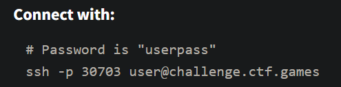
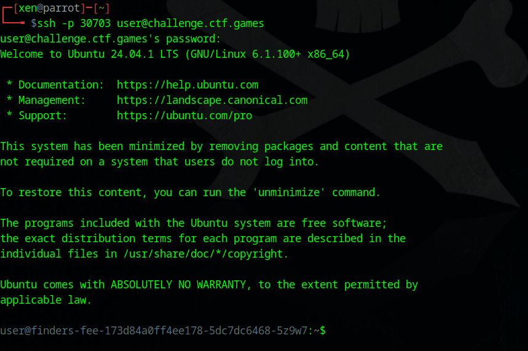
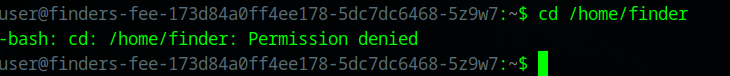
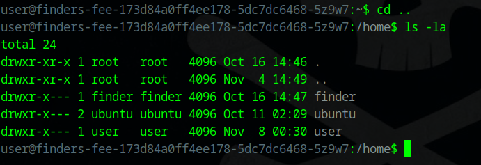
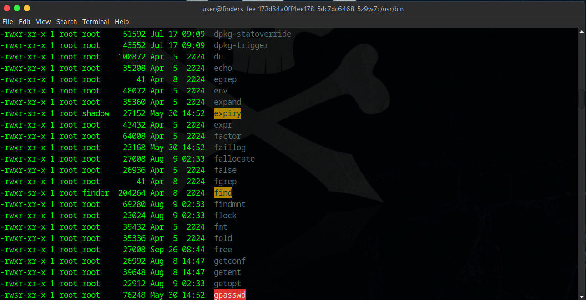
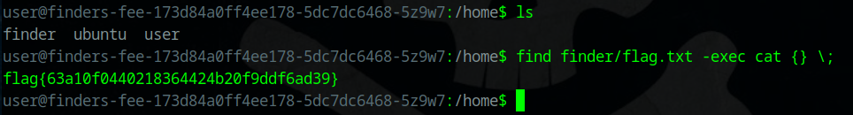

##### <- [Back to Huntress CTF 2024](../README.md)

---

# Finders Fee (Warmups)
Part of the Huntress CTF 2024

#### Description
`You gotta make sure the people who find stuff for you are rewarded well!`

`Escalate your privileges and uncover the flag.txt in the finder user's home directory.`

### Solution
No attachments, so let's hit the `Start` button and get started.



Alright, good ole SSH and it gives us the user/pass combo so that makes that simple. Let's load it up a terminal and connect.



It tells us in the chall description, that the flag is found in the `/home/finder` directory, so let's see if we can go into that folder.



That didn't work, let's look at the permissions on the folder.



As expected, it looks like the `/home/finder` folder is owned by the `finder` user, nothing surprising, but now we know we need to be able to be the `finder` user to access that folder. 

From the name of the chall, I think I know what's already going on, as there is a command called `find` which is a nifty tool, BUT it allows you to run a `-exec` argument with it, that allows you to run commands. I've experienced this before in previous CTFs.

To confirm this to gather additional information, I'm going to navigate over to the `/usr/bin` folder and check out permissions.



Going through the list, mostly everything is owned by the `root` group, except for 3 items. Two are owned by `shadow` and that doens't seem to help me, **BUT** as expected, the `find` tool is owned by the `finder` group. 

This is important because, we should be able to call/use the `find` tool via the command line, **BUT** when we use the `-exec` flag, it should execute the code we give it, as the `finder` group which should give us access to the folder the flag is in (and most likely the flag).

Let's move back to the `/home/` directory and see if this works. I will be running the following command:

```bash
find finder/flag.txt -exec cat {} \;
```

This looks weird but let's step through it. 

`find` = calling the find tool

`finder/flag.txt` = what we are looking for (in this case we know exactly what to look for and where to look)

`-exec` = the 'exec' argument that allows us to run a command based off the results of find

`cat` = output the contents of the flag.txt file to the terminal

`{}` = this acts as a placeholder to inject the 'found' file(s) into the command, in our case we are looking for 1 file

`\;` = the command has to end with a semi-colon and the backslash esacapes the semi-colon so it doens't error 



Just like that. I've seen this flag exploit used in a few different CTFs so it's good to keep in your back pocket for privliage escalation based CTFs challs in the future.

#### FLAG
```
flag{63a10f0440218364424b20f9ddf6ad39}
```
---

##### <- [Back to Huntress CTF 2024](../README.md)