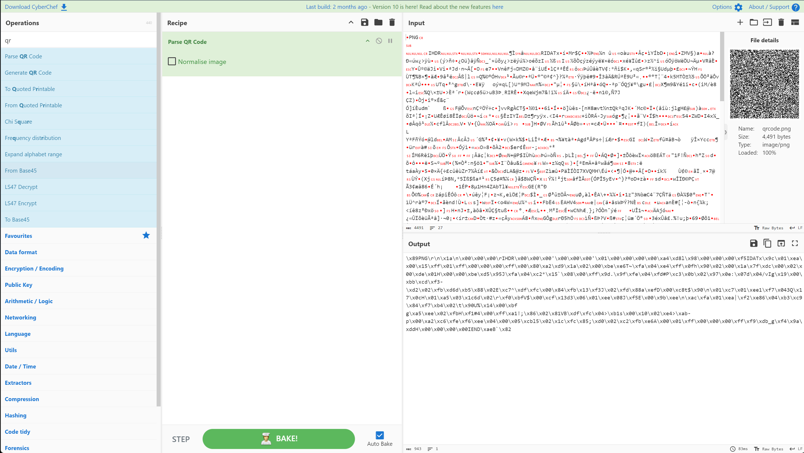
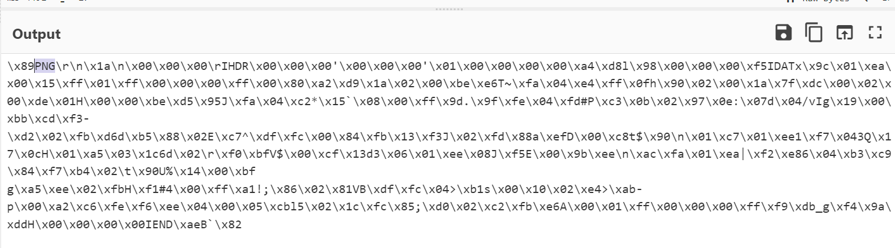

##### <- [Back to Huntress CTF 2024](../README.md)

---

# MatryoshkaQR (Warmups)
Part of the Huntress CTF 2024

### Description

`Wow! This is a big QR code! I wonder what it says...?`

### Attachments
`qrcode.png`

### Solution

With the name of Matryoshka (the Russian nesting dolls), I figured it was something contained within something else (or a series of somethings). There was a QR provided as an attachment, which most likely holds the flag or some data to continue on with the chall. 

Boy is that a big QR code. I wonder what mysteries it holds.


The next step is to decode the QRcode, so our old friend CyberChef to the rescue. I dragged the `qrcode.png` into the `input` field and added the `Parse QR Code` to the `Recipe` section.





Looking at the output, it's hex code, but I also see PNG so this must be hex code to create a `new` PNG image. So essentially at this point, the main QR code had hex code as data, which we can use to create a new PNG to continue on this journey. **Neat.**

Since we are going to be working with hex code to generate a new file, I want to switch over to Python to do the heavy lifting. I then created the following script to read the QR code, capture the hex code data and create the new PNG from that hex code. 

```python
import cv2
from pyzbar.pyzbar import decode

# Load the QR code image
image_path = 'qrcode.png'
image = cv2.imread(image_path)

# Decode the QR code
decoded_objects = decode(image)

# Clean up the hex code so it converts properly to a bytes string
new_img = bytes(decoded_objects[0].data.decode('unicode_escape'), 'latin1')

# Create the new image
with open("new.png", "wb") as f:
    f.write(new_img)
```
And once I ran the code, I was given the proper PNG output.


Oh look, another QR code, albeit smaller. Since we have another QR to decode, let's refactor our script so that the QR decode portion is a function and then let's call it twice and see where the next step goes. 

While developing the script, it became apparent that the second QR code's data was the flag, so I added a print statement at the end of the script and cleaned up the byte coded to be a literal string for a clean output. We have arrived.

```python
import cv2
from pyzbar.pyzbar import decode

# Set some helper variables
original_qr = 'qrcode.png'
new_qr      = 'new.png'

###################

# This function takes in the relative path of an QR code (image)
# and outputs the decoded data
def qr_decode(img_path):
    # Load the QR code image
    img = cv2.imread(img_path)

    # Decode the QR code
    return decode(img)

###################

# Let's Decode the first QR code
data = qr_decode(original_qr)

# Clean up the hex code so it converts properly to a bytes string
new_img = bytes(data[0].data.decode('unicode_escape'), 'latin1')

# Create the new image
with open(new_qr, "wb") as f:
    f.write(new_img)

# Let's Decode the new image
data = qr_decode(new_qr)

# Let's output the resulting flag
print(f'Flag: {data[0].data.decode('utf-8')}')
```

Big thanks to [Linden](https://github.com/JordanLinden) for his help in fixing my mistakes with the string to bytes conversion. 

#### FLAG
```
flag{01c6e24c48f48856ee3adcca00f86e9b}
```
---

##### <- [Back to Huntress CTF 2024](../README.md)