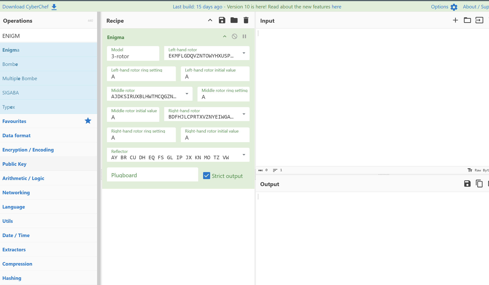
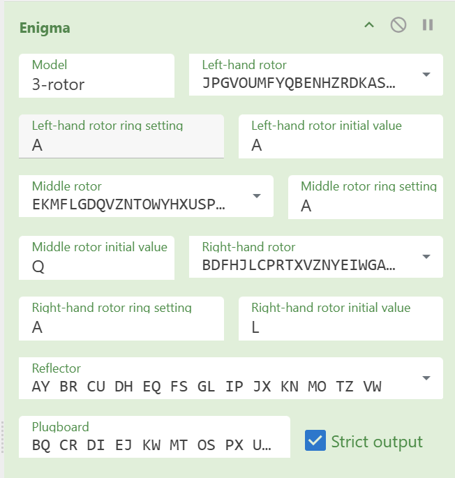
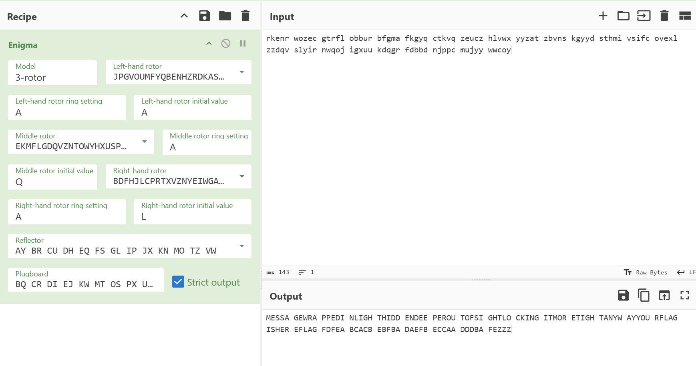

##### <- [Back to Huntress CTF 2024](../README.md)

---

# Mystery (Warmups)
Part of the Huntress CTF 2024

#### Description
`Someone sent this to me...`

`such enigma, such mystery:`

`rkenr wozec gtrfl obbur bfgma fkgyq ctkvq zeucz hlvwx yyzat zbvns kgyyd sthmi vsifc ovexl zzdqv slyir nwqoj igxuu kdqgr fdbbd njppc mujyy wwcoy`

It also provides the following settings:

- 3 Rotor Model
- Rotor 1: VI, Initial: A, Ring A
- Rotor 2: I, Initial: Q, Ring A
- Rotor 3: III, Initial L, Ring A
- Reflector: UKW B
- Plugboard: BQ CR DI EJ KW MT OS PX UZ GH

### Solution
From the onset, when a challenge is talking about rotors, plugboards and says the word `enigma` it's almost alwaqys talking about this beautiful piece of history:


This, of course, is the `Enigma Machine`, a cipher device, which was created by a German engineer and most notriously used extensively by Nazi Germany during WWII. I'm not going to bore you with a history lesson, but [here is the wikipedia article for more information](https://en.wikipedia.org/wiki/Enigma_machine).

They are kind enough to give us all of the settings, so let's hit up our friend [CyberChef](https://gchq.github.io/CyberChef/) and get to work.

We will want to use the search box in the top left area of `CyberChef` to search for `ENIGMA` and drag that box to the `Recipe` column, like so:



Whoa, that looks intimdating, but don't you worry this is actually more simple then it seems. For this chall, `Rotor 1-3` can be identified as that `Rotor 1 = Left-hand rotor`, `Rotor 2 = Middle rotor` and `Rotor 3 = Right-hand rotor`. Let's start at the top of the Enigma box.

```
The settings I used I pulled from the description, you will see the same settings I'm using at the top of this write-up
```

`Model` = we want to keep this to it's 3-rotor default

`Left-hand rotor` = This looks crazy, but click on the drop down, and select the `VI` setting from the description

`Left-hand rotor ring setting` = select `A`

`Left-hand rotor initial value` = select `A`

`Middle rotor` = select `I`

`Middle rotor ring setting` = select `A`

`Middle rotor initial value` = select `Q`

`Right-hand rotor` = select `III`

`Right-hand rotor ring setting` = select `A`

`Right-hand rotor initial value` = select `L`

`Reflector` = select `B`

`Plugboard` = paste `BQ CR DI EJ KW MT OS PX UZ GH`

When you select some of the drop down options, the field will change to some crazy stuff (like the rotor values). That is perfectly normal. After you are done with all of the settings, your Enigma box should look like this:



Now let's paste our encrypted message from the description into the `Input` box of CyberChef and see how we did.

```text
rkenr wozec gtrfl obbur bfgma fkgyq ctkvq zeucz hlvwx yyzat zbvns kgyyd sthmi vsifc ovexl zzdqv slyir nwqoj igxuu kdqgr fdbbd njppc mujyy wwcoy
```



Ok, that isn't the flag we were hoping for. This stumped me for a second until I realized that the result is an English message, it's just broken up into 5 character segements. If we clean it up and reformat it, we get the following:

```
MESSAGE WRAPPED IN LIGHT HIDDEN DEEPER OUT OF SIGHT LOCKING IT MORE TIGHT ANYWAY YOUR FLAG IS HERE 
FLAG FDFEA BCACB EBFBA DAEFB ECCAA DDDBA FEZZZ
```

That makes a lot more sense. Using the above information, we added the curly braces and tried the flag:

`FLAG{FDFEABCACBEBFBADAEFBECCAADDDBAFEZZZ}`

That didn't work. Took us a sec but then we realized that the `ZZZ` at the end of the message, was basically just to denote the message was done. `Z` being the most unlikely used character, three times in a row. We tried it again.

`FLAG{FDFEABCACBEBFBADAEFBECCAADDDBAFE}`

And that worked

#### FLAG
```
flag{FDFEABCACBEBFBADAEFBECCAADDDBAFE}
```
---

##### <- [Back to Huntress CTF 2024](../README.md)