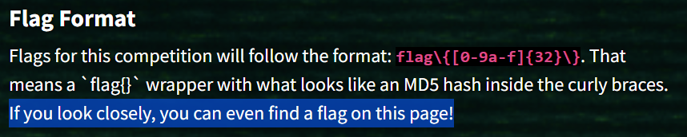
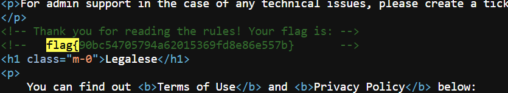

##### <- [Back to Huntress CTF 2024](../README.md)

---

# Read The Rules (Warmups)
Part of the Huntress CTF 2024

#### Description

`Please follow the rules for this CTF!`

### Solution

This one is a little funny, as I typically try to do as much recon as possible before a CTF begins. I was reading the rules they had up before the official start and found the flag. I was told that the flag I found was last years flag, but it turns out, they just reused it again.



The image above is a massive hint that wae are in the right place. I have highlighted the most important part. Now, after searching for the flag prefix `flag{`, nothing was found. The next step is to look at the source code for the page. I opened the source, searched for the prefix again, and there she is!



Voila.

#### FLAG
```
flag{90bc54705794a62015369fd8e86e557b}
```
---

##### <- [Back to Huntress CTF 2024](../README.md)