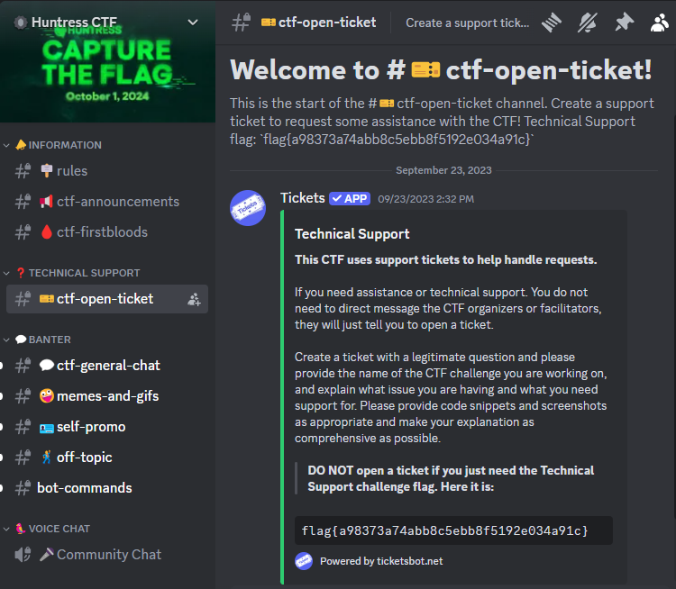

##### <- [Back to Huntress CTF 2024](../README.md)

---

# Technical Support (Warmups)
Part of the Huntress CTF 2024

#### Description
`Want to join the party of GIFs, memes and emoji shenanigans? Or just want to ask a question for technical support regarding any challenges in the CTF?`

`This CTF uses support tickets to help handle requests. If you need assistance, please create a ticket with the #ctf-open-ticket channel. You do not need to direct message any CTF organizers or facilitators, they will just tell you to open a ticket. You might find a flag in the ticket channel, though!`

### Solution
After reviewing the description, it's pretty obvious they want us to look in the official Huntress CTF discord, but also in a specific channel: `#ctf-open-ticket`. 

Upon following that path, we see the following message and, *ta da* the flag. In fact, it's in two places: at the top in the room description as well as the introduction message provided by the `Tickets` app. Easy peasy.



#### FLAG
```
flag{a98373a74abb8c5ebb8f5192e034a91c}
```
---

##### <- [Back to Huntress CTF 2024](../README.md)