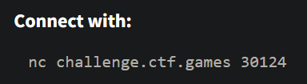
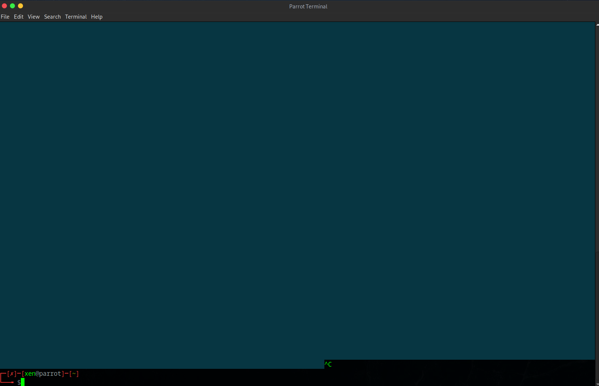
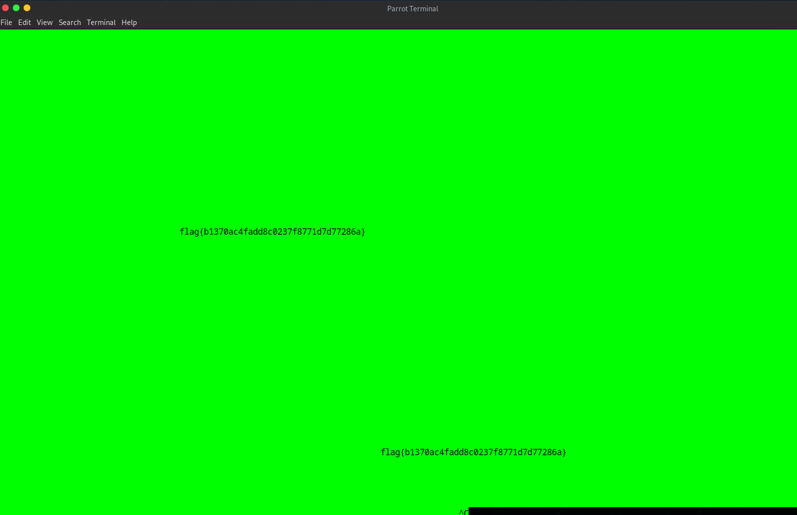

##### <- [Back to Huntress CTF 2024](../README.md)

---

# The Void (Warmups)
Part of the Huntress CTF 2024

#### Description
`When you gaze long into the void, the void gazes also into you...`

### Solution

Let's click the `Start` and get started.



It let's us know where to connect to via `nc`, so let's start up a terminal and connect.



**Whoa!** It started filling my terminal with some sort of characters. I had to hit `CTRL+C` to get it to stop. Very interesting.

After a few tries, there doesn't seem to be much else than that. Going through different things that came into my head, I ended up copying and pasting right in the terminal, which was fruitful.



(sorry for the green)

But we can see the flag. Somehow it was hidden when it was spamming characters, when I pasted it back into the terminal it showed up. My guess you could copy the output from the terminal and pasted it into a notepad or text editor and came up with the same result.

Neat. Chall down. 


#### FLAG
```
flag{b1370ac4fadd8c0237f8771d7d77286a}
```
---

##### <- [Back to Huntress CTF 2024](../README.md)