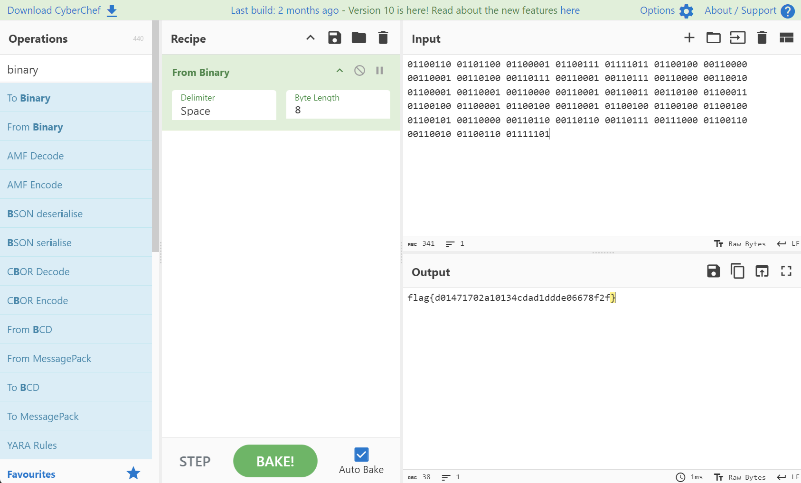

##### <- [Back to Huntress CTF 2024](../README.md)

---

# Too Many Bits (Warmups)
Part of the Huntress CTF 2024

#### Description

`What do all these ones and zero's mean!?! We are in the Warmups category after all...`

`01100110 01101100 01100001 01100111 01111011 01100100 00110000 00110001 00110100 00110111 00110001 00110111 00110000 00110010 01100001 00110001 00110000 00110001 00110011 00110100 01100011 01100100 01100001 01100100 00110001 01100100 01100100 01100100 01100101 00110000 00110110 00110110 00110111 00111000 01100110 00110010 01100110 01111101`

### Solution

At first glance, this is clearly a binary encoded string. With that in mind, let's open up [CyberChef](https://gchq.github.io/CyberChef/). 

I paste the provided binary under the `Input` section and add the `From Binary` Recipe to the list... and BAKE!



Voila.

#### ***Fun Fact:*** 
```
CyberChef (a popular tool for cyber security and CTF folks), is a free and open-source "web based security analysis tool" developed by GCHQ, which is a UK Intelligence Agency. How cool!  
```


#### FLAG
```
flag{d01471702a10134cdad1ddde06678f2f}
```
---

##### <- [Back to Huntress CTF 2024](../README.md)