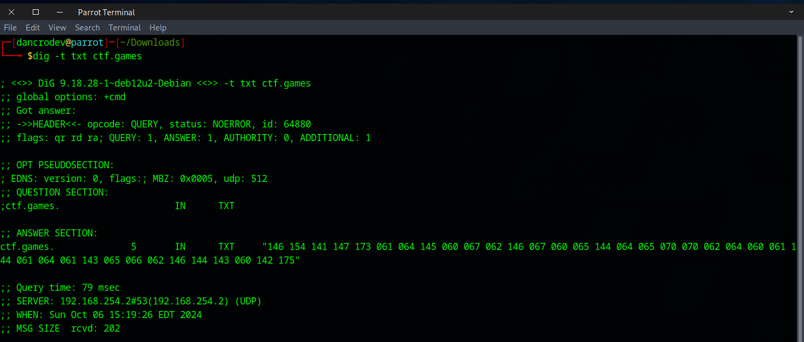
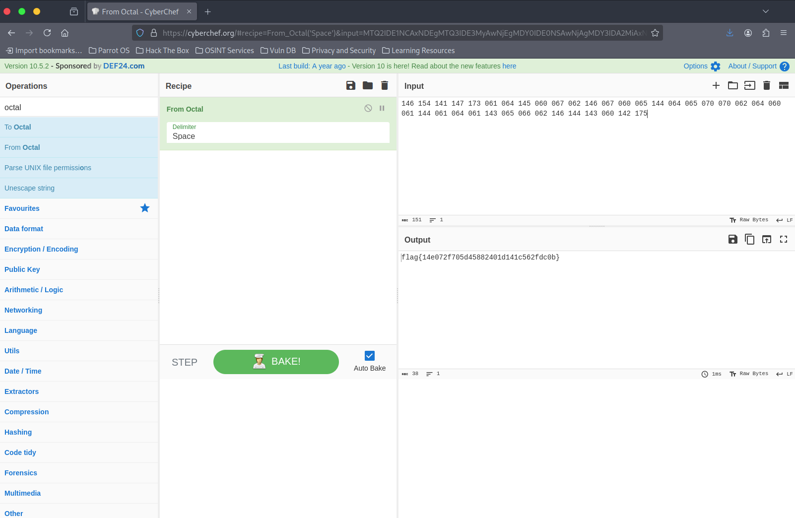

##### <- [Back to Huntress CTF 2024](../README.md)

---

# TXT Message (Warmups)
Part of the Huntress CTF 2024

#### Description
`Hmmm, have you seen some of the strange DNS records for the ctf.games domain? One of them sure is odd...`

```text
Note: the first two characters of the word 'odd' in the above desription, the 'od' is a hyperlink to: https://en.wikipedia.org/wiki/Od_(Unix)
```

### Solution
With the refernece of DNS records, and the name of 'TXT Message' as the title, let's pull out `dig` and do a DNS inquiry for the TXT records for the `ctf.games` domain.



As the link in the description kind of hints at, in the sole TXT record is a series of octals. Let's copy those up and throw them into `Cyberchef`.



And that gives us the flag. Bravo.

#### FLAG
```
flag{14e072f705d45882401d141c562fdc0b}
```
---

##### <- [Back to Huntress CTF 2024](../README.md)