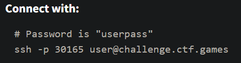
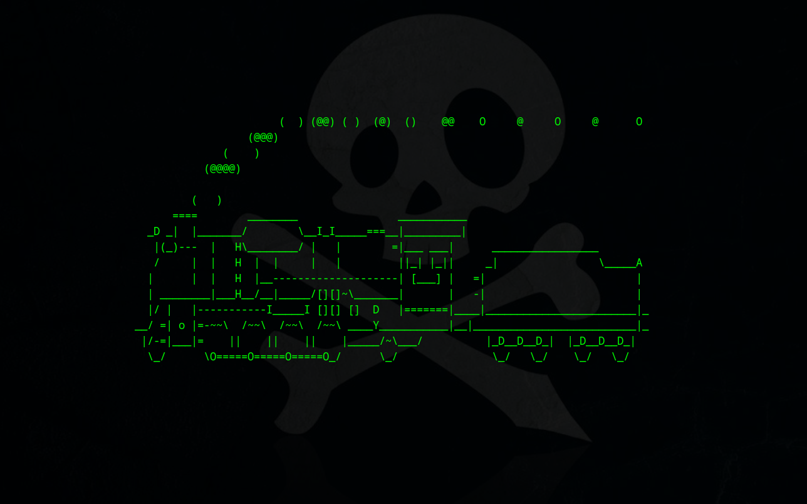
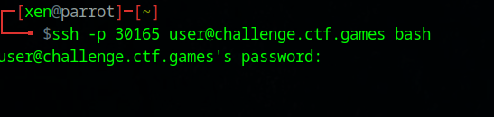
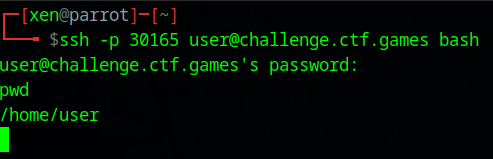
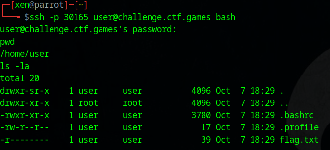
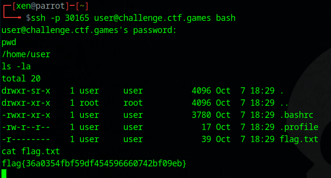

##### <- [Back to Huntress CTF 2024](../README.md)

---

# Typo (Warmups)
Part of the Huntress CTF 2024

#### Description
`Gosh darnit, I keep entering a typo in my Linux command prompt!`

### Solution

Let's click the `Start` and get started.



A SSH connection and it provides us with an initial username `user` and password `userpass`. Let's get connected.



Uh, train anybody? So, this train is the byproduct of a command in linux (if installed) called `sl`. Haven't seen it in a while but, choo choo, here it is. Once it gets done with it's animation, it closed the SSH connection, swell.

Let's connect again, but let's put `bash` at the end of the command (like below), so we have a shell we can poke around with.



This will give us a shell, but it's not like a normal shell, it's just blank space. For example, let's figure out where we are by running the `pwd` command:



I entered in `pwd` and hit enter, and it responded on the next line with `/home/user`. So we are in that directory currently. Let's run an `ls -la` command to see what files are local to this folder.



Looks like there is the `flag.txt` file in the same folder. Let's `cat` that `flag.txt` file and see the output.



And there is the flag. Awesome.

#### FLAG
```
flag{36a0354fbf59df454596660742bf09eb}
```
---

##### <- [Back to Huntress CTF 2024](../README.md)