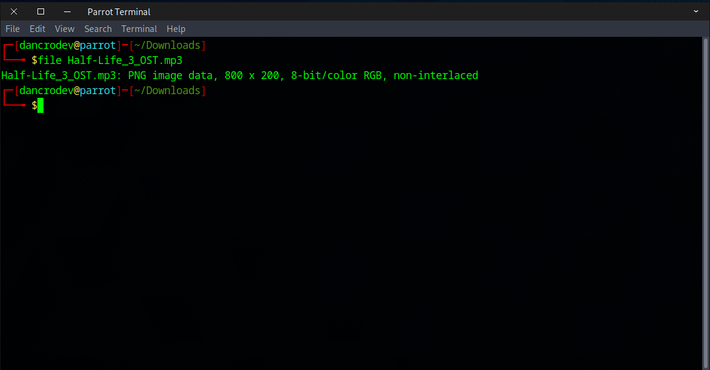
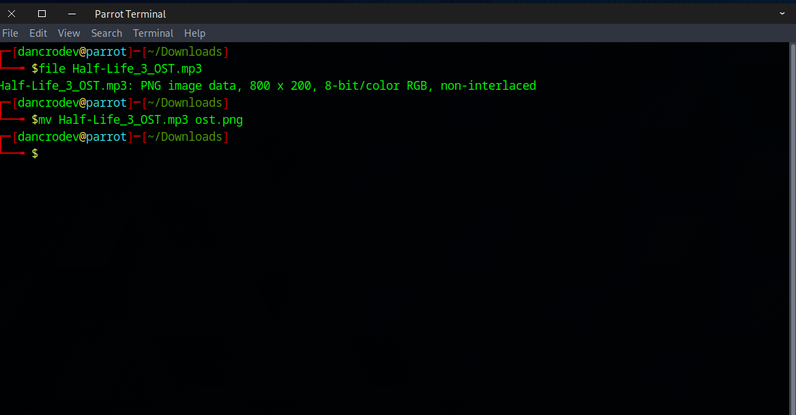
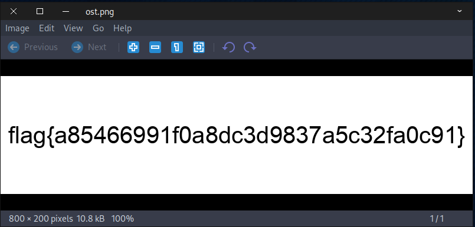

##### <- [Back to Huntress CTF 2024](../README.md)

---

# Unbelieable (Warmups)
Part of the Huntress CTF 2024

#### Description
`Don't believe everything you see on the Internet!`

`Anyway, have you heard this intro soundtrack from Half-Life 3?`

### Attachements
`Half-Life_3_OST.mp3`

### Solution
For this challenge looks like we've been given a .mp3 file. Before we open up Audacity or another tool, let's run it through `file`. The description hints at deception but it's typically a good idea to run any files through `file` as you get a good bit of recon out of that one command.



... and there is why. It is not a mp3 file, it's a PNG image file. Let's change the extention to PNG so we can open it and see what's inside.





Super simple chall.

#### FLAG
```
flag{a85466991f0a8dc3d9837a5c32fa0c91}
```
---

##### <- [Back to Huntress CTF 2024](../README.md)