##### <- [Back to Huntress CTF 2024](../README.md)

---

# Whamazon (Warmups)
Part of the Huntress CTF 2024

#### Description
`Wham! Bam! Amazon is entering the hacking business! Can you buy a flag?`

### Solution
This challenge doesn't provide a lot of instruction but it is one that has a `Start` button to spin up some sort of instance we'll need. Let's "Start" there. (see what I did there? Top tier humor)

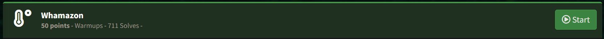

The chall refreshes with a link to `Connect with:`

```
My instance was: http://challenge.ctf.games:32369
(yours would be different)
```

It's ***important*** to note that when I did this challenge, I cannot get this to load into Google Chrome correctly. I spent 20-30 minutes analyzing Javascript trying to figure out what I was supposed to be doing. It wasn't until I was discussing it with my teammate he clued me in that I should be seeing a terminal. Brave browser (no specific reason I chose Brave, just the first browser I clicked on), worked for me.

Let's check out the link.

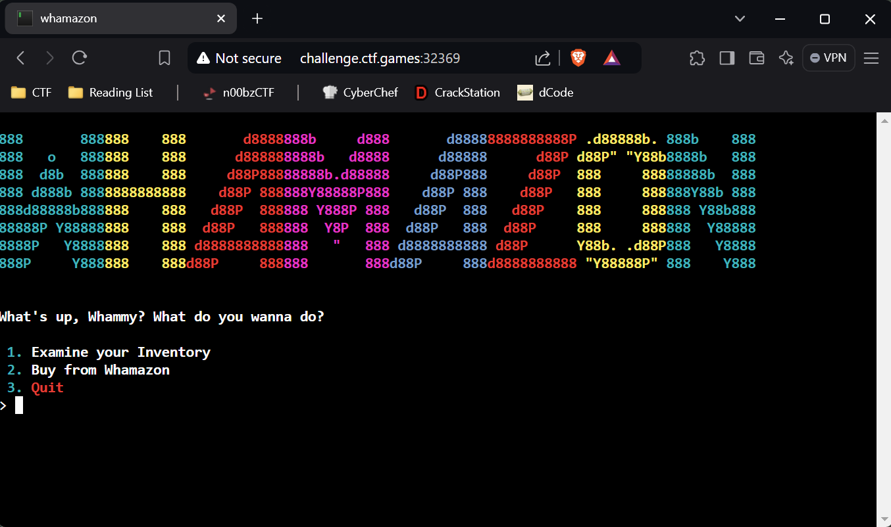

We have arrived. Let's do a little recon and see what the menus do.

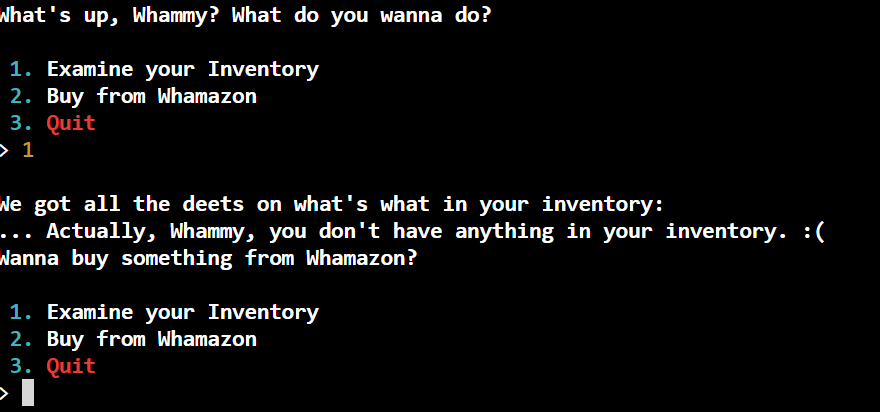

So the inventory seems like it would hold a list of the products we 'purchase' from the terminal. Let's try the `Buy from Whamazon` option

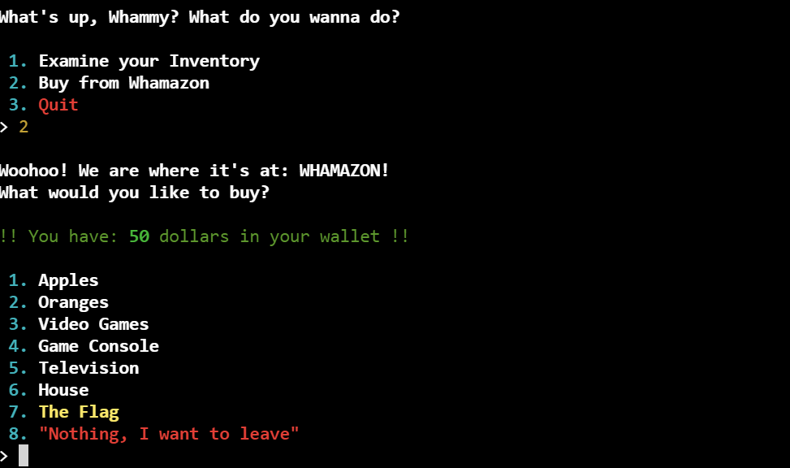

Looks like this is where we want to be. For those curious, the `Quit` option in the menu, does what it says, so nothing important there.

Oh look, we can buy the flag. Let's go ahead and do that.

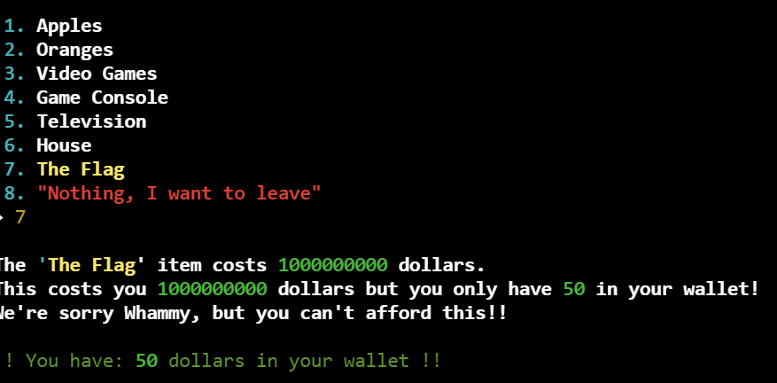

Ok, maybe we are too broke at this time to do that. Let's try to buy something cheaper.

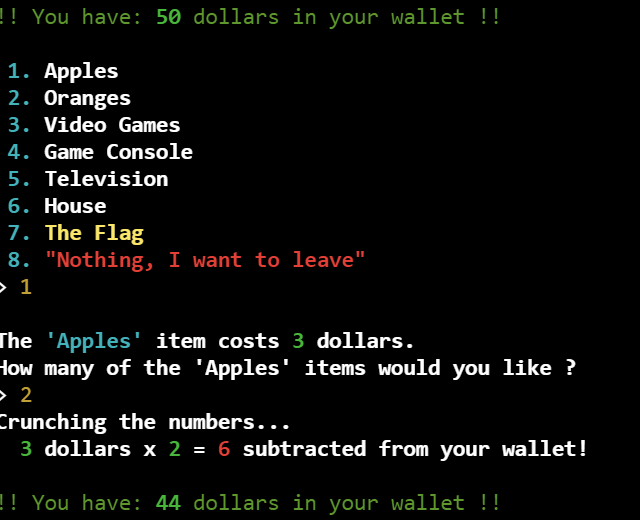

We made the purchase, let's check the inventory.

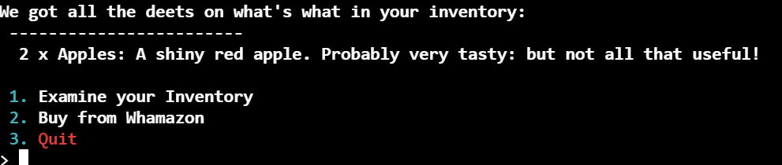

So it does give us the items we paid fork, deduct the cost from our overall funds and places the items into our inventory. Maybe it isn't protecting against negative input, let's give that a shot.

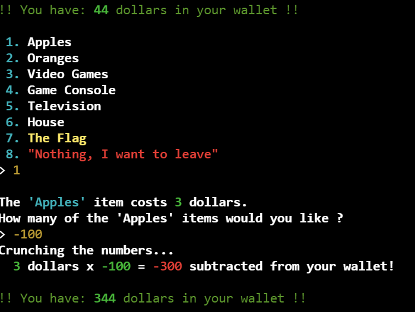

Bingo. You can use something more expensive than the apples but for me, I wanted to overload it, so I chose the apples. 

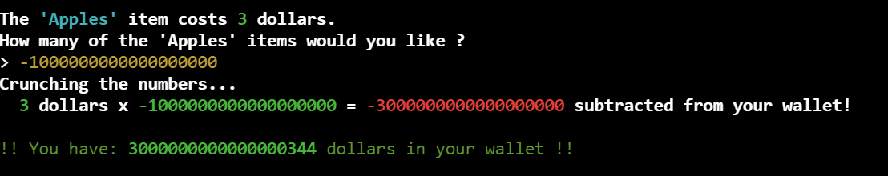

There isn't any secret number to put in here, as long as it's negative it will add to your positive balance. That being said, you need to end up with more then a billion dollars, so you can buy the flag. 

Let's do that now, with our ill gotten gains.

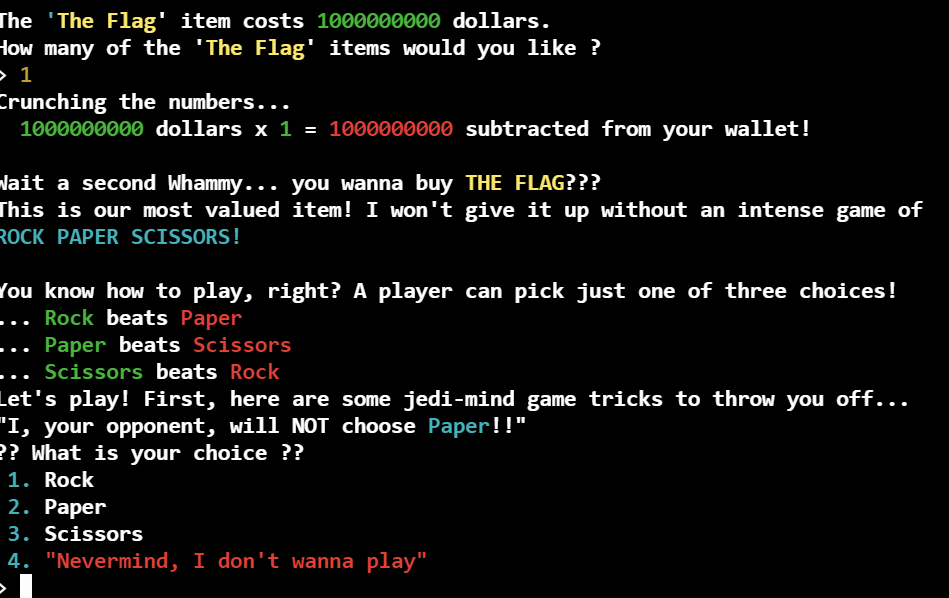

Sweet and now we have the fl.. wait.. now it wants to play Rock Paper Scissors?

```
So this is how this whole Rock/Paper/Scissors thing works. It's not really a challenge, more of an easter egg that you have to go through. Everytime you create a tab/window of Whamazon and go through the motions to get here, the item it says it "will NOT choose" is dynamic. It can be any of the three. I can also say that it won't choose that. The funny part about this, is that the choice is pre-defined and static. Once you make an attempt it allows you to try again, as many times you as need. So pick an option that isn't the one it says it "will NOT choose" and if you are right, great. If not, choose the other one.
```

After the game, you finally get credited with the flag.

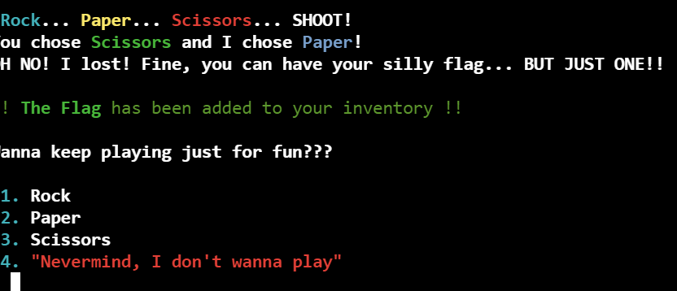

Let's go to the inventory and check it out. 

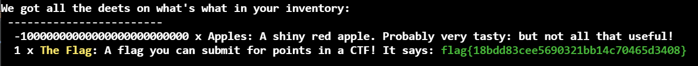

Anyone got Whamazon Prime? 

#### FLAG
```
flag{18bdd83cee5690321bb14c70465d3408}
```
---

##### <- [Back to Huntress CTF 2024](../README.md)