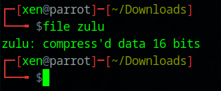
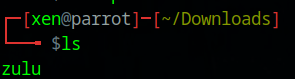
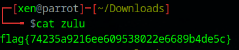

##### <- [Back to Huntress CTF 2024](../README.md)

---

# Zulu (Warmups)
Part of the Huntress CTF 2024

### Description
`Did you know that zulu is part of the phonetic alphabet?`

### Attachments

`zulu`

### Solution

This chall comes with a file, so let's download that file in our VM. After downloading it, I open up a terminal, navigate to my `~/Downloads` directory and run `file zulu`



My VM shows the icon of a compressed object (like a .zip, for example) but it just won't decompress. I searched for `compress'd data 16 bits` and the results talked about a `.z` file. Since the name of the chall is `Zulu`, that kind of makes sense. 

Trying to `uncompress` the file as is, just won't work for me, so I first `mv` the file so I can add the `.z` extension to it.


Ok, let's try to `uncompress` it again.


Let's look to see what the output was



Looks like we have a 'zulu' file again (without an extension). Let's `cat` that file and see what we have.



And there is the flag!

#### FLAG
```
flag{74235a9216ee609538022e6689b4de5c}
```
---

##### <- [Back to Huntress CTF 2024](../README.md)