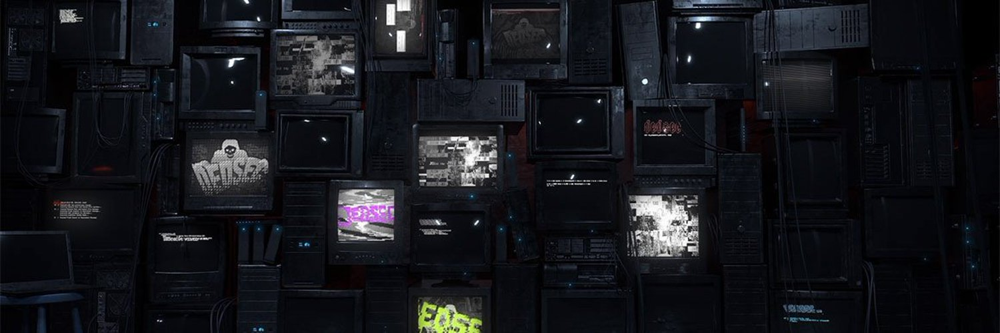

## Capture The Flag (Cyber Security)
This repo contains Results, Writeups and Tools for Cybersecurity Capture-The-Flag Events that I have competed in. 

### Disclosure:
Although I have over 20+ years of IT experience, most of my cyber security knowledge comes from bits and pieces over the years. The solutions I have used to find the flags in the writeups, although my own, may be unorthadox or not the 'correct' way. This is my learning journey, and over time the edges should even out. With that being said, if you want stellar high-quality writeups I recommend you sponge the following accounts: 

- [@jselliott](https://github.com/jselliott)
- [@jjolley91](https://jjolley91.github.io/blog/)
- [@Pir00t](https://ultimacybr.co.uk/hctf23_main/)

### Note:
Some CTFs / Challenges below will be missing writeups. This can be due to me not taking the time to perform write-ups for that event, or in most cases, the event organizers have asked everyone to not do writeups. Sometimes it is a blanket request to never produce public writeups while other times it's time based, such as after an event has concluded.

---

### ***2024***
| Name | Start Date | Duration | Solo / Team Name | Results | Writeups |
|--|--|--|--|--|--|
| Huntress CTF 2024 | 10/01/2024 | 31d | 5 dogs in a trenchcoat | **??** (out of ??) | TBD |
| RSTCon 2024 | 09/13/2024 | 44hr | 🐺 / Dark Wolf Solutions, LLC | **2nd** (out of 347) | - |
| n00bz CTF 2024 | 08/02/2024 | 48hr | The Woobies | **51st** (out of 1237) | - |
| Level Effect 2024 CTF | 06/28/2024 | 21d | ***Solo*** | **25th** (out of 901) | - |
| USCC 2024 Eastern CTF | 06/07/2024 | 4.5hr | Random Team of 4 | **9th** (out of 11) | - |

### ***Non-CTF Challenges & Writeups***
| Name | Finish Date | Description | Finished? | Writeups |
|--|--|--|--|--|
| PwnedLabs | N/A | On-Demand Cloud Purple Team Challenges | N | - |
| PicoCTF | N/A | On-demand CTF-style challenges | N | - |